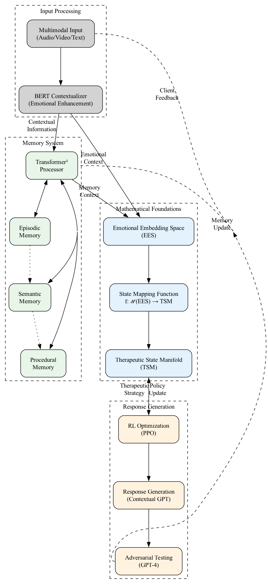

<div align="center">
  
  
  # Nivalde  
  *AI-Driven Psychotherapeutic Platform*
</div>

[](LICENSE)
[](https://python.org)
[](https://nivalde.ai/docs/installation)

## Overview

Nivalde is an advanced AI-driven psychotherapy platform that combines state-of-the-art natural language processing with sophisticated emotional understanding. The system is built on two key mathematical frameworks:

1. **Emotional Embedding Space (EES)**: A high-dimensional state space that captures patient emotional states and their dynamics, including:
   - Natural emotional transitions
   - Phase transition opportunities
   - Path-dependent evolution

2. **Therapeutic State Manifold (TSM)**: A distinct space of therapeutic approaches that guides intervention strategies for optimal patient development.

### Key Features

- **Advanced Emotional Processing**
  - BERT-based contextual understanding
  - Hysteretic state evolution
  - Local topology analysis

- **Sophisticated Therapeutic Planning**
  - Opportunistic intervention strategies
  - Long-term flourishing optimization
  - Natural transition pathways

- **Robust Architecture**
  - Modular component design
  - Comprehensive testing suite
  - Scalable deployment options

### System Components

- **Input Processing**
  - BERT Contextualizer
  - Multimodal Integration
  - Emotional Keyword Enhancement

- **Memory System**
  - Hierarchical Transformer² Architecture
  - Surprise-based Memory Organization
  - Context-aware Retrieval

- **Therapeutic Engine**
  - State Space Mapping
  - Response Generation
  - Intervention Optimization

For detailed documentation, mathematical foundations, and usage examples, see our [comprehensive documentation](https://nivalde.ai/docs/).

## Installation

### System Requirements
| Component | macOS (Development) | Ubuntu 24.10 (Production) |
|-----------|--------------------|----------------------------|
| OS        | 14.4+             | 24.10 LTS                  |
| CPU       | Apple M2+         | x86_64/ARM64               |  
| RAM       | 16GB              | 32GB+                      |
| GPU       | M2 Neural Engine  | NVIDIA A100 (CUDA 12+)     |
| Python    | 3.12+             | 3.12+                      |

### macOS Setup
```bash
# 1. Install Homebrew
/bin/bash -c "$(curl -fsSL https://raw.githubusercontent.com/Homebrew/install/HEAD/install.sh)"

# 2. System dependencies
brew install portaudio graphviz cmake

# 3. Python environment
python -m venv .venv
source .venv/bin/activate
pip install -r requirements.txt
```

### Ubuntu 24.10 Setup  
```bash
# 1. System packages
sudo apt update && sudo apt install -y \
    portaudio19-dev \
    graphviz \
    python3.12-venv

# 2. NVIDIA drivers (CUDA)
sudo apt install -y nvidia-driver-550

# 3. Python setup
python3.12 -m venv .venv
source .venv/bin/activate
pip install -r requirements.txt
```

## Usage

**Development (macOS):**
```bash
# Run with Metal acceleration
python -m src.testing.demo_sessions --device mps

# Start local API
uvicorn src.api.main:app --reload
```

**Production (Ubuntu):**  
```bash
# Enable CUDA acceleration
python -m src.api.main --prod --cuda

# Docker deployment
docker run -it --gpus all -p 8080:8080 nivalde:latest
```

## Directory Structure
```
.
├── configs/             # Platform-specific configs
│   ├── macos.yaml
│   └── ubuntu.yaml
├── src/
│   ├── input/          # OS-specific processing
│   │   ├── audio/
│   │   │   ├── coreaudio.py  # macOS
│   │   │   └── pulse.py       # Linux
│   │   └── video/
│   │       ├── metal/         # macOS
│   │       └── cuda/          # Linux
└── docs/
    └── platform-setup.md      # Detailed OS guides
```

<div align="center">
  
</div>

## Documentation
- [macOS Development Guide](https://nivalde.ai/docs/macos-setup)
- [Ubuntu Production Setup](https://nivalde.ai/docs/ubuntu-deployment)
- [Cross-Platform Testing](https://nivalde.ai/docs/testing)

## Documentation

The documentation is built using [Sphinx](https://www.sphinx-doc.org/). To build the docs:

```bash
# Install documentation dependencies
pip install -r docs/requirements.txt

# Build the documentation
cd docs
make html

# View the documentation (macOS)
open build/html/index.html

# View the documentation (Linux)
xdg-open build/html/index.html
```

The built documentation will be available in `docs/build/html/`. For development, you can use `make livehtml` to automatically rebuild the documentation when changes are detected.
