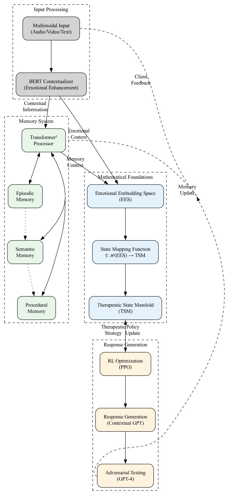

Nivalde AI Psychotherapy Platform
================================

Welcome to the Nivalde AI Platform documentation. This platform implements an advanced
AI-driven psychotherapy system using state-of-the-art natural language processing and
emotional understanding.

System Architecture
------------------

For detailed architecture diagrams and component interactions, see :doc:`architecture/diagrams`.

Contents
--------

.. toctree::
   :maxdepth: 2
   :caption: Getting Started

   introduction
   installation
   quickstart

.. toctree::
   :maxdepth: 2
   :caption: Architecture

   architecture/overview
   architecture/diagrams

.. toctree::
   :maxdepth: 2
   :caption: Core Components

   components/bert_contextualizer
   components/memory_system
   components/emotional_embedding
   components/session_manager

.. toctree::
   :maxdepth: 2
   :caption: Mathematical Foundations

   math/foundations

.. toctree::
   :maxdepth: 2
   :caption: Examples

   examples/complete_session

.. toctree::
   :maxdepth: 2
   :caption: Development

   contributing

Key Features
-----------

1. Advanced Input Processing
   - BERT-based contextualization
   - Emotional keyword emphasis
   - Rich semantic understanding

2. Sophisticated Memory System
   - Transformer² architecture
   - Hierarchical storage based on surprise/novelty
   - Efficient context retrieval

3. Emotional Processing
   - Integration of current and historical context
   - Natural emotional continuity
   - Adaptive state evolution

4. Session Management
   - Complete conversation processing
   - Emotional progression tracking
   - Comprehensive session analysis

Getting Started
-------------

Installation
~~~~~~~~~~

.. code-block:: bash

   pip install nivalde

Basic Usage
~~~~~~~~~

.. code-block:: python

   from nivalde.therapy import TherapySession
   
   # Create therapy session
   session = TherapySession()
   
   # Process client input
   state = session.process_input(
       "I've been feeling anxious",
       emotional_keywords=["anxious", "worry"]
   )
   
   # Access emotional state
   emotional_state = state['emotional_state']

Contributing
-----------

We welcome contributions! Please see our :doc:`contributing` guide for details.
